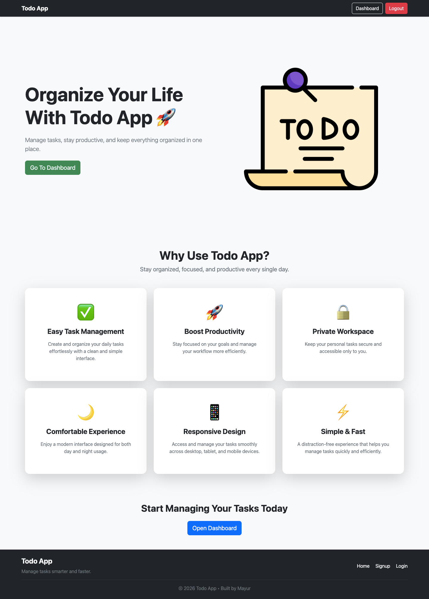
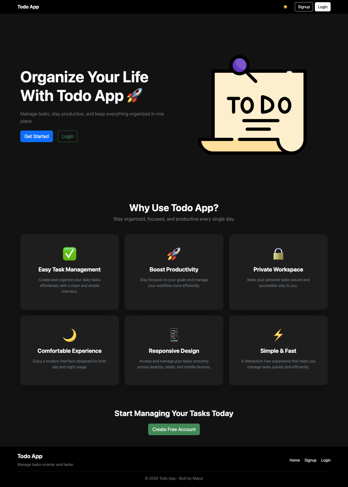
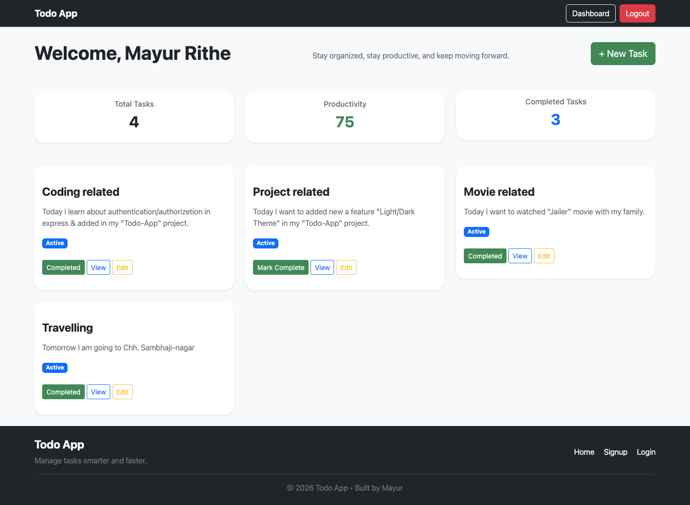
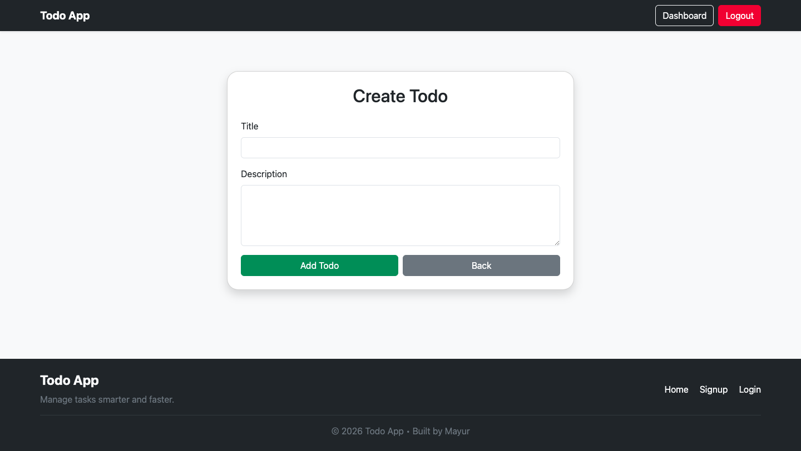
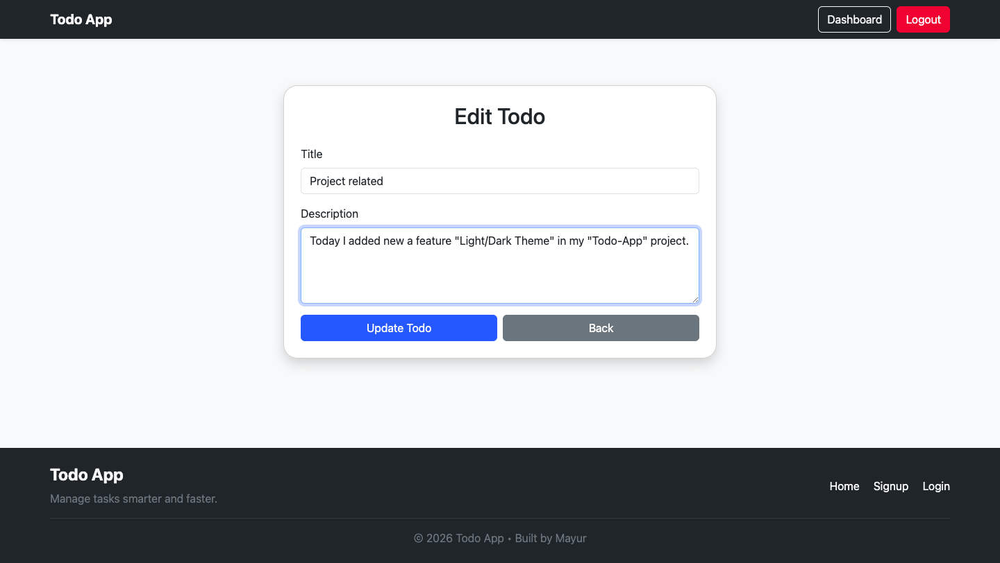
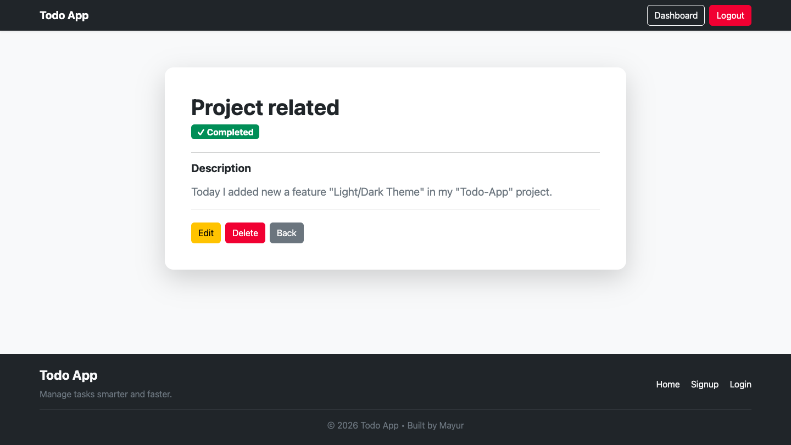
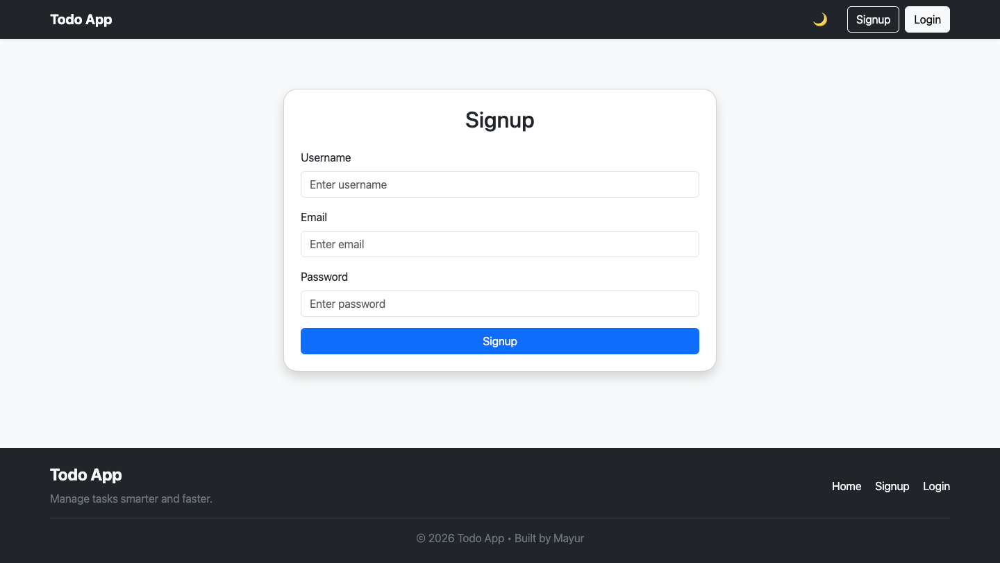
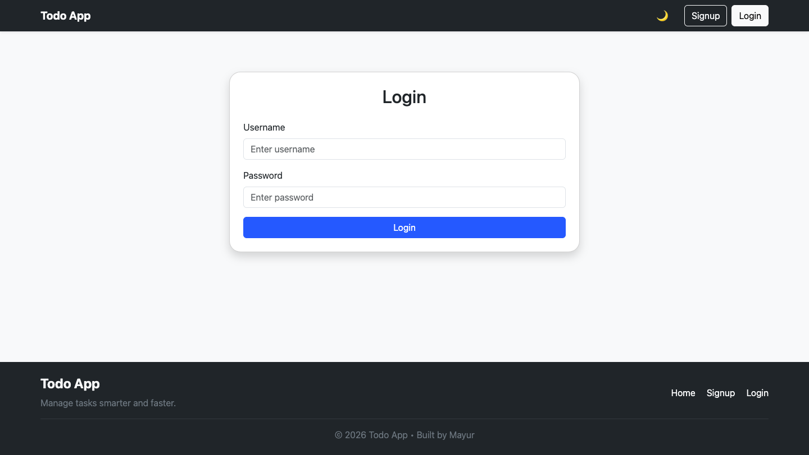

# 📝 Todo App

A full-stack task management application built with Node.js, Express.js, MongoDB, EJS, Bootstrap, and Passport.js for secure user authentication.

This application allows users to securely manage their personal tasks with authentication, task tracking, search functionality, dark/light mode, and a responsive dashboard.

---

## 🚀 Key Features

### 🔐 User Authentication

- User Signup
- User Login
- User Logout
- Session-based Authentication
- Protected Routes

### ✅ Task Management

- Create Todo
- View Todo Details
- Edit Todo
- Delete Todo
- Mark Task as Complete
- Personal Todo Dashboard

### 📊 Dashboard Features

- Total Tasks Counter
- Completed Tasks Counter
- Productivity Percentage
- Task Status Indicators

---

### 🎨 Modern UI

- Responsive Design
- Bootstrap 5 Layout
- Dark / Light Mode
- Sticky Navbar
- Professional Dashboard Cards
- Mobile-Friendly Interface

---

## 📂 Project Structure

```bash

todo-app
│
├── controllers
│   ├── todos.js
│   └── users.js
│
├── models
│   ├── todo.js
│   └── user.js
│
├── public
│   ├── script.js
│   └── style.css
│
├── routes
│   ├── todoRoutes.js
│   └── userRoutes.js
│
├── screenshots
│   ├── create-page.png
│   ├── dark-page.png
│   ├── edit-page.png
│   ├── home-page.png
│   ├── landing-page.png
│   ├── login-page.png
│   ├── show-page.png
│   └── signup-page.png
│
├── utils
│   └── wrapAsync.js
│
├── views
│   ├── includes
│   │   ├── footer.ejs
│   │   └── navbar.ejs
│   │
│   ├── layouts
│   │   └── boilerplate.ejs
│   │
│   ├── todos
│   │   ├── home.ejs
│   │   ├── index.ejs
│   │   ├── new.ejs
│   │   ├── edit.ejs
│   │   └── show.ejs
│   │
│   └── users
│       ├── login.ejs
│       └── signup.ejs
│
├── middleware.js
├── server.js
├── package.json
├── package-lock.json
├── .env
├── .gitignore
└── README.md
```

---

## 🛠️ Tech Stack

### Frontend

- HTML5
- CSS3
- Bootstrap 5
- EJS

### Backend

- Node.js
- Express.js

### Database

- MongoDB
- Mongoose

### Authentication

- Passport.js
- Passport Local
- Express Session

### Utilities

- Method Override
- Dotenv
- Connect Flash

---

## ⚙️ Installation

### Clone Repository

```bash
git clone https://github.com/Mayur-Rithe-14/todo-app.git
```

### Navigate to Project

```bash
cd todo-app
```

### Install Dependencies

```bash
npm install
```

### Create Environment Variables

Create a `.env` file:

```env
ATLASDB_URL=your_mongodb_connection_string
SECRET=your_session_secret
```

### Run Application

```bash
node server.js
```

or

```bash
nodemon server.js
```

---

## 📸 Screenshots

### Landing Page




### Home Page



### Create Page



### Edit Page



### Show Single Todo Page



### Signup Page



### Login Page



---

## 🎯 Learning Outcomes

Through this project I learned:

- MVC Architecture
- RESTful Routing
- CRUD Operations
- Authentication & Authorization
- Session Management
- MongoDB Data Modeling
- Express Middleware
- Responsive UI Design

---

## 👨‍💻 Author

**Mayur Rithe**

Aspiring Full-Stack (MERN) Developer passionate about building modern web applications and continuously learning new technologies.

### Connect With Me

- GitHub: [Mayur-Rithe-14](https://github.com/Mayur-Rithe-14)
- LinkedIn: [Mayur Rithe](https://www.linkedin.com/in/mayur-rithe-ab527a306/)

---

## ⭐ Future Improvements

- Due Date Management
- Task Categories
- Priority Levels
- Drag & Drop Tasks
- Email Notifications
- React Frontend Version
- REST API Integration

---

### If you like this project, don't forget to ⭐ the repository.

```

```
